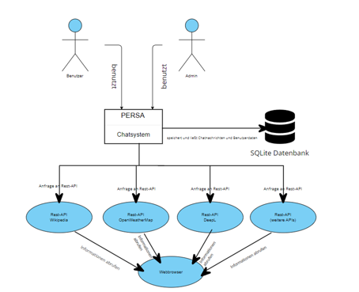
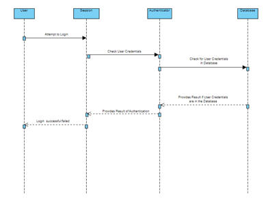
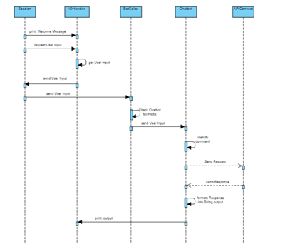
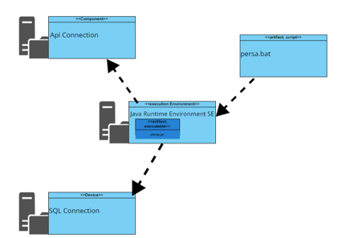

# B O doppel N
**Mitglieder:**
* Youssef Abdellaoui
* Philipp Amendt
* Jan Höltje

# Inhaltsverzeichnis
- [1. Systemdokumentation](#1-systemdokumentation)
    - [1.1 Einleitung](#11-einleitung)
    - [1.2 Kontextabgrenzung](#12-kontextabgrenzung)
  	- [1.2.1 Visualisierung](#121-visualisierung)
        - [1.2.2 Fachlicher Kontext](#122-fachlicher-kontext)
        - [1.2.3 Technischer Kontext](#123-technischer-kontext)
    - [1.3 Lösungsstrategie](#13-lösungsstrategie)
    - [1.4 Bausteinsicht](#14-bausteinsicht)
    - [1.5 Laufzeitsicht](#15-laufzeitsichten)
    - [1.6 Infrastruktursicht](#16-infrastruktursicht)
    - [1.7 Querschnittliche Konzepte](#17-querschnittliche-konzepte)
    - [1.8 Schnittstellen](#18-schnittstellen)
        - [1.8.1 Translation Bot](#181-translation-bot)
      	- [1.8.2 Weather Bot](#182-weather-bot)
        - [1.8.3 Wiki Bot](#183-wiki-bot)
        - [1.8.4 SQL-Datenbank](#184-sql-datenbank)
    - [1.9 Risiken und technische Schulden](#19-risiken-und-technische-schulden)
    - [1.10 Erweiterungen](#110-erweiterungen)
    - [1.11 Fehlerbehebung](#111-fehlerbehebung)
    - [1.12 Installationsanleitung](#installationsanleitung)
    - [1.13 Konfiguration](#konfiguration)
- [2 Bot Dokumentation](#bot-dokumentation)
    - [2.1 Übersetzer-Bot](#übersetzer-bot)
        - [2.1.1 Kontextabgrenzung](#kontextabgrenzung)
        - [2.1.2 Lösungsstrategie](#lösungsstrategie)
        - [2.1.3 Bausteinsicht](#bausteinsetz)
        - [2.1.4 Laufzeitsicht](#laufzeitsicht)
    - [2.2 Wetter-Bot](#wetter-bot)
        - [2.2.1 Kontextabgrenzung](#kontextabgrenzung)
        - [2.2.2 Lösungsstrategie](#lösungsstrategie)
        - [2.2.3 Bausteinsicht](#bausteinsetz)
        - [2.2.4 Laufzeitsicht](#laufzeitsicht)
    - [2.3 Wiki-Bot](#wiki-bot)
        - [2.3.1 Kontextabgrenzung](#kontextabgrenzung)
        - [2.3.2 Lösungsstrategie](#lösungsstrategie)
        - [2.3.3 Bausteinsicht](#bausteinsetz)
        - [2.3.4 Laufzeitsicht](#laufzeitsicht)
- [3 Weitere Schritte](#weitere-schritte)

# 1. Systemdokumentation

## 1.1 Einleitung

Die Software „PERSA“ stellt einen Chatbot dar, der als Mehrzweck-Chatbot verschiedene Bot-Funktionen integriert, um den Benutzer ein nützliches und vielseitiges Erlebnis zu bieten. In diesem Zusammenhang wurden ein Wetterbot, ein Wikibot, ein Übersetzerbot, sowie die Funktion, weitere Chatbots einfach und nahtlos in das Gesamtsystem zu integrieren.

Die Nutzer werden nach erfolgreicher Anmeldung von dem Chatbot Persa angesprochen. Daraufhin entscheidet sich der Nutzer für einen der Chatbot und kann diesen direkt ansprechen.

Der Wetterbot ist ein integriertes Modul, das Echtzeit-Wetterinformationen, sowie Prognosen über das Wetter aus einer Quelle abruft und dem Benutzer präsentiert.

Der Wikibot bietet dem Benutzer die Möglichkeit, einfachen Zugriff zu bestimmten Themen, Personen, Orten oder Ereignissen aus Wikipedia zuzugreifen.

Der Übersetzerbot ermöglicht dem Benutzer Texte zwischen verschiedenen Sprachen zu übersetzen.

Stakeholder des Chatbots sind die Benutzer sowie Administratoren. Alle Stakeholder erwarten eine Anwendung ohne Fehlermeldung und Störungen.

## 1.2 Kontextabgrenzung

Um eine Kontextabgrenzung der Software zu ermöglichen, sollte im Vorhinein eine oberflächliche Darstellung der einzelnen Akteure und deren Zusammenhänge oberflächlich vorgenommen werden. In dieser Arbeit wird dies mithilfe des beigefügten Diagramms visualisiert.

### 1.2.1 Fachlicher Kontext

Der Benutzer interagiert mit dem System und erhält darauf Antworten. Die Konversation wird dabei in einer Datenbank gespeichert und kann gegebenenfalls abgerufen werden. Die Anfrage des Benutzers wird mittels einer Application Programming Interface (API) verarbeitet und die Antwort wird generiert und an den Benutzer weitergegeben.

### 1.2.2 Technischer Kontext

Über das Control Panel interagiert der Benutzer mit dem System. Das System dient dabei auch als Schnittstelle für die Systemantworten und nutzt spezifische API-Anfragen, um die Daten mit der API auszutauschen. Des Weiteren wird die Verbindung zwischen dem System und der Datenbank durch eine SQL-Verbindung hergestellt.

### 1.2.3 Visualisierung

In dem Diagramm sind die zwei Beteiligten Benutzer und Admin abgebildet. Der Admin kann das Gesamtsystem starten, sowie weitere Chatbots hinzufügen. Des Weiteren können Admin und Benutzer sich anmelden und daraufhin einen Chatbot auswählen und diesen ansprechen. Die Chatnachrichten werden dann in der SQLite Datenbank gespeichert und können auch abgerufen werden.

Nachdem der Benutzer oder der Admin das Chatsystem angesprochen hat, erkennt dieser aus der Nachricht welcher Chatbot gemeint ist und kann dadurch eine Anfrage an die dafür ausgewählte Rest-API senden. Diese ruft dann im Webbrowser die Informationen ab und leitet diese zurück ans Chatsystem, welches dem Benutzer oder dem Admin die Antwort anzeigt.

## 1.3 Lösungsstrategie

## 1.4 Bausteinschicht

## 1.5 Laufzeitschicht

Die Laufzeitsicht lässt sich in zwei Aspekte unterteilen, zum Einem in die Userinteraktionen und den Ablauf des Programms:

Der Ablauf der Userinteraktion bezieht sich auf den Login. Um die Verbindung zwischen beiden Sequenzdiagrammen herzustellen wird Programmablaufdiagramm angenommen, dass der Login erfolgreich war sodass mit dem ersten User Input angefangen wird.

Im Sequenzdiagramm wird mit dem User begonnen und dieser versucht sich einzuloggen. Dies wird in der Session Klasse durchgeführt und die Eingaben (Benutzername und Passwort) werden zum überprüfen an den Authenticator übergeben. Dieser überprüft, ob die eingegebenen Daten in der Datenbank, in der die Benutzernamen und zugehörigen Passwörter gespeichert sind, vorhanden sind. Das Ergebnis wird dann wieder vom Authenticator an die Session übergeben und diese sagt dann dem User, ob der Login erfolgreich oder fehlgeschlagen hat.

Der Ablauf des Programmes beginnt mit der Session Klasse und diese lässt vom IOHandler die Willkommensnachricht ausgeben und erwartet daraufhin eine Usereingabe. Nachdem der IOHandler die Usereingabe erhalten hat, wird diese zurück an die Session und von dieser aus an den BotCaller geschickt. Der BotCaller überprüft dann die Nachricht auf den Prefix und kann anhand diesem erkennen, an welchem Chatbot die Usereingabe weitergegeben wird. Der Chatbot identifiziert dann den Command und gibt gegebenenfalls den Request and die APIConnection weiter und erhält von dieser die Antwort. Diese Antwort wird dann noch in einen String angepasst und dann an den IOHandler übergeben, welche die Antwort dann ausgibt.

## 1.6 Infrastrukturschicht

Das Programm wird auf der execution Evironment Ebene unter dem Java Runtime Evironment SE als ausführbares Artifakt unter persa.jar ausgeführt. Die Usereingaben werden unter dem artifact, script unter persa.bat eingegeben. Das execution Evironment führt zum einem die Verbindung zur Komponente Api Connection, um die Api Abfragen der Chatbots durchzuführen, und zur SQL Connection für die Datenbankabfragen durch.

## 1.7 Querschnittliche Konzepte

Die Software nutzt das abstrakte Fabrik-Muster und das Decorator Pattern als Design Patterns, welche in verschiedenen Situationen nützlich sein können.

Das Abstrakte Fabrik-Muster ermöglicht die Erzeugung von Objektfamilien, ohne die konkreten Klassen dieser Objekte zu spezifizieren. Es definiert eine abstrakte Fabrik-Schnittstelle, die konkrete Fabriken implementieren müssen. Jede konkrete Fabrik ist in der Lage, eine Familie von zusammengehörenden Objekten zu erzeugen, ohne Details über die tatsächlichen Klassen dieser Objekte preiszugeben.

In Bezug auf die Software könnte das Abstrakte Fabrik-Muster verwendet werden, um die verschiedenen Api Verbindungen und Chatbots zu erzeugen. Sie könnten eine abstrakte Fabrik definieren, die die Methoden zur Erstellung dieser Komponenten vorgibt. Dann würden konkrete Fabriken für jede unterstützte Plattform diese abstrakte Fabrik implementieren und die spezifischen Komponenten für ihre Plattform erzeugen.

Das Abstrakte Fabrik-Muster ermöglicht es, Code zu schreiben, der unabhängig von der konkreten Implementierung der Objekte ist, was die Wartung und Erweiterung erleichtert. Es ist besonders nützlich, wenn eine Anwendung plattformübergreifend ist und verschiedene Varianten derselben Komponenten benötigt.

Die Software verwendet das Decorator Pattern, um eine eigene Klasse für die Ausgabe zu erstellen und die Flexibilität bei der Formatierung und Erweiterung der Ausgabe zu verbessern. Indem es dieses Muster anwendet, kann die Software eine Basisklasse für die Datenerzeugung oder -verwaltung verwenden und dann verschiedene Dekoratoren hinzufügen, um die Ausgabe nach Bedarf anzupassen. Diese Dekoratoren können beispielsweise Textformatierungen, Farben oder spezielle Symbole hinzufügen, ohne die ursprüngliche Datenerzeugungsklasse zu ändern.

Das Decorator Pattern ermöglicht es der Software, die Ausgabe flexibel an verschiedene Anforderungen anzupassen, indem es neue Dekoratoren hinzufügt oder bestehende kombiniert. Dies fördert die Wartbarkeit und Erweiterbarkeit des Codes, da Änderungen oder Erweiterungen an der Ausgabe unabhängig von der Kernfunktionalität vorgenommen werden können. Dadurch wird die Software anpassbarer und kann auf einfache Weise unterschiedliche Ausgabeformate und -optionen bereitstellen, was insbesondere in situationsabhängigen Umgebungen von Vorteil ist.

Zusammenfassend bieten Design Patterns wie das Abstrakte Fabrik-Muster und das Decorator Pattern bewährte Lösungen für wiederkehrende Probleme in der Softwareentwicklung und fördern die Wiederverwendbarkeit, die Wartbarkeit und die Erweiterbarkeit des Codes.

## 1.8 Schnittstellen

| Schnittstelle       | Zweck und Funktion                       | Operationen      | Kommunikationsprotokoll | Datenformat       | Authentifizierung                               |
|---------------------|------------------------------------------|------------------|-------------------------|-------------------|-------------------------------------------------|
| DeepL API           | Übersetzungsdienst für Texte             | GET              | HTTP                    | JSONObject        | API-Key                                         |
| Wikipedia API       | Abruf von Informationen aus Wikipedia    | GET              | HTTP                    | JSONObject        | N/A                                             |
| OpenWeather API     | Wetterdatenabruf für bestimmte Standorte | GET              | HTTP                    | JSONObject        | API-Key                                         |
| Database Connection | Kommunikation mit der Datenbank          | Lesen, Schreiben | SQL                     | Tabellen, Objekte | N/A                                             |

Die Chatbot-Anwendung interagiert mit externen Systemen mithilfe von Application Programming Interfaces (APIs), die als Schnittstellen dienen. Diese Schnittstellen ermöglichen die Bereitstellung einer Vielzahl von Diensten wie beispielsweise Textübersetzung, Wetterinformationen und Wissensabfragen. Um diese Verbindung zu den APIs herzustellen, nutzt die Anwendung die Klasse "ApiConnection". Innerhalb dieser Klasse steht die Methode "connectToApi" zur Verfügung, die eine Hypertext Transfer Protocol (HTTP)-Verbindung zu den jeweiligen APIs aufbaut und JSON-formatierte Antworten empfängt. Im Kontext der Klasse "SqlOperations" wird eine Verbindung zu einer internen Datenbank hergestellt, die dazu dient, die Verlaufsdokumentation der Konversationen mit den Nutzern zu speichern.
	
### 1.	Translation Bot
Bei dem Translation-Bot, der die DeepL API nutzt, erhält der Chatbot durch diese Technologie Zugriff auf fortschrittliche maschinelle Übersetzungsfunktionen von DeepL. Das ermöglicht dem Chatbot, hochwertige Übersetzungen in Echtzeit anzubieten. Die Software sendet eine HTTP-Anfrage an die DeepL API, um eine Übersetzung zu erhalten. Diese Anfrage enthält den zu übersetzenden Text und die gewünschte Zielsprache. Die API antwortet daraufhin mit der übersetzten Version des Textes. 
Die entsprechende API-URL ist: https://api-free.deepl.com/v2/translate.

### 2.	 Weather Bot
Im Falle des Weather-Bots, welcher die Openweathermap API nutzt, ermöglicht diese Schnittstelle den Abruf von aktuellen Wetterinformationen für eine bestimmte Stadt. Die Anfrage an die Openweathermap API erfolgt ebenfalls per HTTP-Anfrage, wobei der Name der Stadt angegeben wird. Die API stellt daraufhin relevante Wetterdaten wie Temperatur und Windgeschwindigkeit für die angegebene Stadt zur Verfügung. 
Die entsprechende API-URL ist: http://api.openweathermap.org/data/2.5/weather.

### 3.   Wiki Bot
Der Wiki-Bot, der die offizielle Wikipedia API nutzt, eröffnet dem Chatbot Zugriff auf die umfassende Wikipedia-Datenbank, um Nutzern gezielte Informationen zu speziellen Themen bereitzustellen. Die Kommunikation mit der Wikipedia API erfolgt durch die Software mittels einer HTTP-Anfrage, bei der der gewünschte Suchbegriff übermittelt wird. Als Antwort erhält die Software eine Liste relevanter Wikipedia-Seiten, die mit dem angegebenen Suchbegriff in Verbindung stehen. 
Die entsprechende API-URL lautet: https://de.wikipedia.org/w/rest.php/v1/search/page.

### 4.	 SQL-Datenbank
Die Schnittstelle zur SQL-Datenbank in unserer Anwendung ermöglicht einen nahtlosen Zugriff auf die darin gespeicherten Daten. Sie stellt eine Verbindung zur SQL-Datenbank über den Hostname der SQLite Datenbank her. Sobald die Verbindung hergestellt ist, kann die Anwendung SQL-Anfragen an die Datenbank senden, um Daten abzurufen, einzufügen, zu aktualisieren oder zu löschen. Diese Anfragen werden als SQL-Statements übermittelt, die von der Datenbank verarbeitet werden, um Daten hinzuzufügen, zu lesen oder zu ändern. Die Schnittstelle zur SQL-Datenbank spielt somit eine zentrale Rolle in der Anwendung und ermöglicht einen effizienten Umgang mit den gespeicherten Daten.

Für den eigentlichen Austausch von Informationen mit den oben genannten APIs ist die Klasse APIConnect verantwortlich. Diese nimmt die zusammengestellten URLs aus den jeweiligen Bots als Parameter entgegen und etabliert mithilfe dieser Verbindungen zu den APIs. Innerhalb dieser Klasse steht eine generische Methode zur Verfügung, mittels derer GET-Anfragen an die entsprechenden APIs gesendet werden können. Die Antworten der APIs werden als JSONObject zurückgeliefert, das die von der API empfangenen Daten enthält. Falls es während der Kommunikation mit der API zu Fehlern kommt, werden vordefinierte Texte abgegeben oder Ausnahmen (Exceptions) geworfen, abhängig von der Art des Fehlers.

### Motivation???

Neben den Kontext der Schnittstellen ist die Spezifikation zu robuster Kommunikation entscheidend. Diese Spezifikation wird hier festgelegt.

### Form
Tabellenform und/oder Verweis auf Schemata

## Erweiterungen

## 1.9 Risiken und teschnische Schulden

In unserer Software sind mehrere kritische Risikofaktoren und technische Herausforderungen zu identifizieren, die unsere Entwicklungs- und Sicherheitsbemühungen erheblich beeinflussen können. Diese Risiken betreffen vor allem die Abhängigkeiten zu den App-Verbindungen und der SQL-Datenbank, das Fehlen von Unit Tests im Code sowie die potenzielle Vulnerabilität für SQL-Injektionen. Darüber hinaus besteht die Besorgnis, dass die derzeitigen Administratorenrechte keine hinreichende Unterscheidung zwischen einem Administrator und einem normalen Benutzer ermöglichen.

1. **Abhängigkeiten zu den App-Verbindungen und der SQL-Datenbank:**
   Unsere Software verlässt sich stark auf externe Abhängigkeiten, insbesondere auf App-Verbindungen und die SQL-Datenbank. Veränderungen in diesen Abhängigkeiten, wie API-Änderungen oder Datenbankschemamodifikationen, könnten unvorhergesehene Auswirkungen auf die Softwarefunktionalität haben. Die mangelnde Kontrolle über diese externen Abhängigkeiten stellt ein Risiko für die Stabilität und die langfristige Wartbarkeit unseres Systems dar.

2. **Fehlen von Unit Tests im Code:**
   Die Abwesenheit von Unit Tests im Code erhöht das Risiko von Funktionsfehlern und Bugs erheblich. Ohne gründliche Testabdeckung kann die Identifizierung und Behebung von Fehlern zeitaufwändig und fehleranfällig sein. Dies kann zu unerwarteten Ausfällen oder Leistungsproblemen führen und die Softwarequalität insgesamt beeinträchtigen.

3. **SQL-Injektionsrisiko:**
   Die Software zeigt eine potenzielle Schwachstelle in Bezug auf SQL-Injektionen. Wenn keine ausreichenden Schutzmechanismen implementiert sind, könnten Angreifer schädlichen SQL-Code in die Anwendung einschleusen und Datenbankzugriffe manipulieren. Dies stellt ein erhebliches Sicherheitsrisiko dar und kann zu Datenverlust, Datenschutzverletzungen oder der Kompromittierung der Integrität der Anwendung führen.

4. **Administratorrechte ohne Unterschied zum normalen Nutzer:**
   Die derzeitige Implementierung der Administratorrechte innerhalb der Software bietet keinen hinreichenden Unterschied oder zusätzliche Sicherheitsvorkehrungen im Vergleich zu normalen Benutzern. Dies führt dazu, dass Administratoren und normale Benutzer ähnliche Zugriffsrechte und Privilegien haben. Dies kann zu mangelnder Kontrolle und möglichen Sicherheitsrisiken führen, da Administratoren Zugang zu sensiblen Daten und Funktionen benötigen, die von normalen Benutzern eingeschränkt sein sollten.

Um diese Risiken zu minimieren, ist es unerlässlich, eine umfassende Risikobewertung und Sicherheitsüberprüfung durchzuführen. Darüber hinaus sollten Maßnahmen ergriffen werden, um die Abhängigkeiten zu externen Komponenten zu verwalten, Unit-Tests zu implementieren, um die Codequalität sicherzustellen, Sicherheitslücken durch gründliche Validierung und Prepared Statements in der Datenbank zu verhindern und die Rollen und Berechtigungen von Administratoren und normalen Benutzern sorgfältig zu überdenken und zu differenzieren. Eine kontinuierliche Überwachung und Aktualisierung dieser Sicherheits- und Entwicklungspraktiken ist entscheidend, um den reibungslosen Betrieb und die Sicherheit unserer Software zu gewährleisten.

## 1.10 Erweiterungen

## 1.11 Fehlerbehebung

**Abhängigkeitsmanagement:** Es werden externe Abhängigkeiten überwacht und sicherstellt, sodass die Software mit Änderungen in den App-Verbindungen und der SQL-Datenbank kompatibel bleibt.

**Implementierung von Unit Tests:** Es wird aktiv daran gearbeitet, Unit Tests in dem Code zu integrieren, um die Codequalität und -stabilität zu erhöhen.

**Sicherheitsüberprüfung und Schutz vor SQL-Injektionen:** Es werden geeignete Sicherheitsmaßnahmen, wie Prepared Statements und Datenvalidierung, eingeführt, um das Risiko von SQL-Injektionen zu minimieren.

**Administratorrechte:** Es werden die Rollen und Berechtigungen für Administratoren und normale Benutzer überarbeitet, um die Sicherheit und den Datenschutz zu gewährleisten.

Es ist entscheidend, diese Risiken und Herausforderungen im Laufe des Projekts aktiv zu überwachen und geeignete Maßnahmen zu ergreifen, um die Software stabil, sicher und funktionsfähig zu halten.

## 1.12 Installationsanleitung

## 1.13 Konfiguration

Der User gibt er seinen Nutzernamen sowie sein Passwort ein. Sind die eingegebenen Daten korrekt, wird der Nutzer erfolgreich eingeloggt und erhält Zugriff auf die Chatbots. Falls das eingegebene Passwort nicht korrekt ist, wird der Nutzer aufgefordert, die Daten erneut einzugeben, bis die korrekten Anmeldedaten eingegeben wurden.

Unser Chatsystem bietet eine breite Palette von Befehlen, die es Benutzern ermöglichen, auf verschiedene Funktionen zuzugreifen und das Chaterlebnis zu individualisieren. Hier ist eine detaillierte Auflistung der Konfigurationen und deren jeweilige Funktionen:

**!Persa info**

Dieser Befehl gibt Ihnen umfassende Informationen zum PERSA Chatsystem. Wenn Sie Fragen zur Funktionsweise des Chatsystems haben oder mehr über seine Möglichkeiten erfahren möchten, ist dieser Befehl hilfreich.

**!Persa credits**

Mit diesem Befehl können Sie herausfinden, wer an der Entwicklung und Umsetzung des PERSA Chatsystems beteiligt war. Wir möchten die Gelegenheit nutzen, um unseren talentierten Teammitgliedern für ihre Arbeit und ihr Engagement zu danken.

**!Persa log**

Wenn Sie den Verlauf der letzten Anfragen und Antworten im Chatsystem überprüfen möchten, ist dieser Befehl genau das Richtige. Der Log liefert Einblicke in vergangene Konversationen und Interaktionen.

**!Persa botliste**

Mit diesem Befehl können Sie eine detaillierte Liste der verfügbaren Bots und ihren aktuellen Status abrufen. Dies ist nützlich, um zu erfahren, welche Bots derzeit aktiv sind und welche nicht.

**!Persa status [botname]**

Wenn Sie Informationen zum Status eines bestimmten Bots benötigen, verwenden Sie diesen Befehl. Geben Sie den Namen des Bots als Parameter an, um seinen aktuellen Status zu erfahren.

**!Persa aktivieren [botname]**

Sie haben die Möglichkeit, Bots individuell zu aktivieren, wenn Sie ihre Dienste nutzen möchten. Mit diesem Befehl können Sie einen bestimmten Bot aktivieren, damit er in Ihren Chats verfügbar ist.

**!Persa deaktivieren [botname]**

Wenn Sie einen Bot vorübergehend nicht verwenden möchten, können Sie ihn mit diesem Befehl deaktivieren. Dadurch wird der Bot in Ihren Chats inaktiv, bis Sie ihn erneut aktivieren.

Diese Befehle bieten eine Fülle von Möglichkeiten, das PERSA Chatsystem nach Ihren Bedürfnissen anzupassen und zu steuern. Wir haben sie sorgfältig entwickelt, um sicherzustellen, dass Sie eine reibungslose und effiziente Kommunikation erleben.

Wie Befehle verwendet werden:

Um einen Befehl in Ihrem Chat einzugeben, tippen Sie einfach das Ausrufezeichen "!" gefolgt von dem Befehl und optionalen Parametern (falls erforderlich). Zum Beispiel:

•	!Persa info zeigt Informationen zum Chatsystem an.

•	!Persa status Bot zeigt den Status des Bots mit dem Namen "Bot" an.

# 2 Bot Dokumentation

## 2.1 Übersetzer-Bot

### 2.1.1 Kontextabgrenzung

**Fachlicher Kontext:**

Der Translator Bot ist ein digitales System, das speziell entwickelt wurde, um Nutzern bei der nahtlosen und präzisen Übersetzung von Texten in verschiedene Sprachen zu unterstützen. Im Rahmen dieses Fachkontextes sind folgende Schlüsselaspekte zu berücksichtigen:

1. **Nutzerinteraktion:** Der Translator Bot ermöglicht es den Nutzern, auf eine intuitive Weise mit ihm zu interagieren. Dies erfolgt durch die Eingabe von Texten, die übersetzt werden sollen, sowie die Auswahl der gewünschten Zielsprache. Die Interaktion zwischen dem Nutzer und dem Bot bildet das Herzstück dieses Systems.

2. **Zielsprachenauswahl:** Um den unterschiedlichen Bedürfnissen der Nutzer gerecht zu werden, bietet der Bot die Möglichkeit, die gewünschte Zielsprache für die Übersetzung festzulegen. Diese Auswahl kann je nach Bedarf und Sprachkenntnissen des Nutzers variieren.

3. **Textverarbeitung und Übersetzung:** Der Bot übernimmt die Aufgabe der Textverarbeitung und Übersetzung mithilfe der DeepL API. Diese fortschrittliche Schnittstelle ermöglicht eine präzise und qualitativ hochwertige Übersetzung von Texten in Echtzeit. Die Texte werden dabei in die gewählte Zielsprache umgewandelt.

4. **Übersetzungsausgabe:** Nachdem die Übersetzungsverarbeitung abgeschlossen ist, stellt der Translator Bot dem Nutzer das übersetzte Ergebnis zur Verfügung. Dies kann in Form von Textausgaben oder anderen geeigneten Formaten erfolgen, um sicherzustellen, dass die Nutzer die gewünschten Informationen in der gewünschten Sprache erhalten.

**Technischer Kontext:**

Im technischen Kontext des Translator Bots sind die folgenden technischen Aspekte von Bedeutung:

1. **Nutzerinteraktion über IOHandler:** Die Kommunikation zwischen dem Nutzer und dem Bot erfolgt über einen speziellen IOHandler, der als Schnittstelle für die Systemantworten dient. Dies gewährleistet eine klare und reibungslose Kommunikation zwischen dem Nutzer und dem Bot, wodurch eine benutzerfreundliche Erfahrung ermöglicht wird.

2. **Einschränkung auf bestimmte Sprachen:** Der Bot ist so konfiguriert, dass er nur bestimmte Sprachen akzeptiert, um die Effizienz und Qualität der Übersetzungen sicherzustellen. Diese Auswahl an unterstützten Sprachen wird sorgfältig verwaltet, um die Ressourcen des Systems optimal zu nutzen.

3. **API-Anfrageerstellung:** Bei der Verarbeitung von Sprach- und Texteingaben wird eine API-Anfrage an die DeepL API erstellt. Dieser Prozess erfolgt automatisch und transparent für den Nutzer. Die Anfrage beinhaltet den zu übersetzenden Text sowie die Ziel- und Ausgangssprachen, um eine präzise Übersetzung sicherzustellen.

4. **JSON-Rückgabeverarbeitung:** Die Antwort von DeepL erfolgt in Form von JSON-Daten. Diese Daten werden vom Translator Bot verarbeitet und in einen formatierten String umgewandelt, um dem Nutzer das übersetzte Ergebnis auf verständliche Weise präsentieren zu können.

In diesem detaillierten Kontext sind die verschiedenen Aspekte des Translator Bots hervorgehoben, sowohl im fachlichen als auch im technischen Bereich, um ein umfassendes Verständnis seiner Funktionsweise zu vermitteln.

### 2.1.2 Lösungsstrategie

Die Lösungsstrategie für den Übersetzer Bot beginnt mit der Aktivierung durch den Nutzer über den Befehl "!translator" im IOHandler. Dieser Befehl fungiert als Auslöser für den BotCaller, der den Übersetzer Bot aktiviert. Wenn der Nutzer lediglich den Befehl "!translator" eingibt, wird eine Liste der verfügbaren Befehle und unterstützten Sprachen angezeigt, um dem Nutzer die Auswahl zu erleichtern.

Die Zielsprache kann der Nutzer durch Eingabe des entsprechenden Sprachcodes auswählen, wobei DE für Deutsch, EN für Englisch, ES für Spanisch, FR für Französisch und IT für Italienisch stehen. Ein Beispiel wäre "!translator EN" für die Übersetzung ins Englische. Nach der Sprachauswahl wird der Nutzer aufgefordert, den zu übersetzenden Text oder das zu übersetzende Wort über den IOHandler einzugeben.

Der Übersetzer Bot verarbeitet den Sprachcode und den eingegebenen Text, um eine URL für die Übersetzungsdienst-API zu generieren. Diese URL wird dann an die Klasse "APIConnect" übergeben, die einen HTTP GET-Request an die API sendet und die Antwort verarbeitet.

Im Falle eines fehlgeschlagenen Requests oder eines API-Problems wird eine entsprechende Fehlermeldung an den Nutzer zurückgegeben. Bei einer erfolgreichen Anfrage erhält die APIConnect-Klasse ein JSON-Objekt als Antwort, das der Übersetzer Bot verarbeitet und in einen gut formatierten Text umwandelt. Diese formatierte Übersetzung wird dem Nutzer über den IOHandler präsentiert.

Auf diese Weise ermöglicht der Übersetzer Bot eine effiziente und benutzerfreundliche Übersetzung von Texten und Wörtern in verschiedenen Sprachen, wobei Fehlerbehandlung und klare Ausgabe im Vordergrund stehen.

### 2.1.3 Bausteinsicht

### 2.1.4 Laufzeitsicht

## Wetter-Bot

### Kontextabgrenzung

**Fachlicher Kontext:**

Der Wetter Bot ist ein spezialisiertes digitales System, das dazu entwickelt wurde, Nutzern detaillierte Wetterinformationen für deutsche Städte bereitzustellen. Im Rahmen dieses fachlichen Kontextes sind folgende Schlüsselaspekte zu berücksichtigen:

1. **Nutzerinteraktion:** Dieser Bot ermöglicht den Nutzern eine interaktive Kommunikation. Nutzer können den Bot ansprechen und Anfragen bezüglich des Wetters in deutschen Städten stellen.

2. **Wetterabfrage für Städte:** Der Bot ist darauf ausgerichtet, Wetterinformationen für Städte weltweit bereitzustellen. Dies ermöglicht es den Nutzern, relevante und präzise Wetterdaten für das gewünschte geografische Gebiet zu erhalten.

3. **Wahl zwischen aktuellem Wetter und Prognose:** Die Benutzer haben die Flexibilität zu entscheiden, ob sie Informationen zum aktuellen Wetter oder zur Wetterprognose abfragen möchten. Diese Option ermöglicht es den Nutzern, ihre Anfragen an ihre spezifischen Bedürfnisse anzupassen.

4. **Textverarbeitung:** Der Bot nutzt die Openweather API, um die eingegebenen Textanfragen zu verarbeiten und in Wetterinformationen umzuwandeln. Dieser Prozess umfasst sowohl die Abfrage der Daten als auch die Formatierung der Ergebnisse.

5. **Wetterausgabe:** Nachdem der Bot die Wetterdaten verarbeitet hat, gibt er die Ergebnisse an den Nutzer aus. Dies kann in Form von textbasierten Antworten erfolgen, um die gewünschten Wetterinformationen klar und verständlich darzustellen.

**Technischer Kontext:**

Im technischen Kontext des Wetter Bots sind die folgenden technischen Aspekte von Bedeutung:

1. **Nutzerinteraktion über IOHandler:** Die Kommunikation zwischen dem Nutzer und dem Bot erfolgt über einen IOHandler, der als Schnittstelle für Systemantworten dient. Dies ermöglicht eine strukturierte und benutzerfreundliche Interaktion.

2. **Textüberprüfung und Prognoseentscheidung:** Der Bot analysiert die vom Nutzer eingegebenen Textanfragen und erkennt, ob der Nutzer nach aktuellen Wetterdaten oder einer Prognose fragt. Diese Unterscheidung ist entscheidend für die korrekte Verarbeitung der Anfrage.

3. **Überprüfung der Stadt:** Bevor der Bot Wetterdaten abruft, überprüft er, ob die angegebene Stadt in seiner Datenbank vorhanden ist. Falls die Stadt nicht gefunden wird, gibt der Bot eine Fehlermeldung aus, um den Nutzer zu informieren.

4. **JSON-Rückgabeverarbeitung:** Die Wetterdaten werden von der Openweather API in Form von JSON-Daten zurückgegeben. Der Bot verarbeitet diese Daten und stellt sie in einem angepassten, gut lesbaren Format dar, abhängig von der Art der angeforderten Informationen.

In diesem ausführlichen Kontext werden die verschiedenen Aspekte des Wetter Bots, sowohl im fachlichen als auch im technischen Bereich, betont, um ein umfassendes Verständnis seiner Funktionsweise und seines Zwecks zu vermitteln.

### Lösungsstrategie

Der Wetter Bot wird aktiviert, wenn der Nutzer den Befehl "!weather" im IOHandler eingibt. Dieser Befehl dient als Auslöser für den BotCaller, um den Wetter Bot zu starten. Wenn der Nutzer "!weather" ohne weitere Angabe eingibt, zeigt der Bot eine Befehlsliste an, die dem Nutzer die Wahl zwischen aktuellem Wetter und Wettervorhersage ermöglicht.

Der Nutzer kann wählen, ob er das aktuelle Wetter oder eine Wettervorhersage abfragen möchte. Für eine einfache Wetterabfrage gibt der Nutzer "!weather" gefolgt von der gewünschten Stadt ein. Wenn er eine Wettervorhersage möchte, fügt er "Prognose" hinzu, also "!weather" gefolgt von der Stadt und "Prognose".

Die Stadteingabe erfolgt über den IOHandler. Der Nutzer gibt den Namen der Stadt ein, für die er das Wetter abfragen möchte. Der Bot wird dann versuchen, die Wetterdaten für diese Stadt zu erhalten.

Der Bot verarbeitet die Eingabe des Nutzers und erstellt eine URL für die Anfrage an die Wetter-API, abhängig davon, ob eine Wetterabfrage oder eine Prognose angefordert wird. Diese URL wird an die Klasse "APIConnect" übergeben, die einen HTTP GET-Request an die API sendet und die Antwort verarbeitet.

Im Falle eines fehlgeschlagenen Requests oder anderer Probleme bei der API-Anfrage wird eine Fehlermeldung an den Nutzer zurückgegeben, um ihn über das Problem zu informieren.

Bei einer erfolgreichen Anfrage an die API erhält die APIConnect-Klasse ein JSON-Objekt als Antwort. Dieses JSON-Objekt wird vom Wetter Bot verarbeitet und in einen gut formatierten Text umgewandelt. Der Text stellt entweder das aktuelle Wetter für die angegebene Stadt oder eine fünftägige Wettervorhersage dar. Auf diese Weise ermöglicht der Wetter Bot eine präzise und benutzerfreundliche Abfrage von Wetterinformationen, sowohl für das aktuelle Wetter als auch für Prognosen, wobei Fehlerbehandlung und klare Ausgabe im Vordergrund stehen, um eine reibungslose Benutzererfahrung sicherzustellen.

### Bausteinsicht

### Laufzeitsicht

## Wiki-Bot

### Kontextabgrenzung

**Fachlicher Kontext:**

Der Wiki Bot ist ein spezialisiertes digitales System, das es Nutzern ermöglicht, umfassende Informationen zu einer Vielzahl von Themen aus der Wikipedia abzurufen. Im Rahmen dieses fachlichen Kontextes sind folgende Schlüsselaspekte zu berücksichtigen:

1. **Nutzerinteraktion:** Der Wiki Bot ermöglicht den Nutzern, interaktiv mit ihm zu kommunizieren. Nutzer können beliebige Suchanfragen an den Bot weiterleiten, um Informationen zu verschiedenen Themen zu erhalten.

2. **Vielfältige Suchanfragen:** Die Benutzer haben die Freiheit, nahezu jede erdenkliche Suchanfrage an den Wiki Bot zu richten. Dies ermöglicht es den Nutzern, spezifische Informationen zu suchen und ihr Wissen zu erweitern.

3. **Textverarbeitung und Weiterleitung an Wikipedia API:** Wenn der Nutzer eine Suchanfrage stellt, verarbeitet der Bot die eingegebene Textanfrage und leitet sie an die Wikipedia API weiter. Diese Schnittstelle ermöglicht den Zugriff auf die umfangreiche Wissensdatenbank von Wikipedia.

4. **Kurze und prägnante Darstellung:** Nachdem die Informationen von der Wikipedia API abgerufen wurden, extrahiert der Bot die wichtigsten Details und präsentiert sie in einer Stichpunktliste. Diese Darstellung ist kurz, knapp und leicht verständlich, um die Relevanz und Klarheit der bereitgestellten Informationen zu gewährleisten.

**Technischer Kontext:**

Im technischen Kontext des Wiki Bots sind die folgenden technischen Aspekte von Bedeutung:

1. **Nutzerinteraktion über IOHandler:** Die Kommunikation zwischen dem Nutzer und dem Bot erfolgt über einen IOHandler, der als Schnittstelle für Systemantworten dient. Dies ermöglicht eine benutzerfreundliche und strukturierte Interaktion.

2. **Textüberprüfung und Validierung:** Der Bot analysiert die vom Nutzer eingegebene Textanfrage, um sicherzustellen, dass sie sinnvoll ist und verarbeitet werden kann. Wenn die Anfrage nicht verstanden werden kann, gibt der Bot eine entsprechende Fehlermeldung aus.

3. **Suchanfrage an Wikipedia:** Nach der Überprüfung leitet der Bot die Suchanfrage an die Wikipedia API weiter, um relevante Informationen abzurufen. Dieser Prozess erfolgt automatisch und transparent für den Nutzer.

4. **JSON-Rückgabeverarbeitung:** Die Informationen von der Wikipedia API werden in Form von JSON-Daten zurückgegeben. Der Bot verarbeitet diese Daten und stellt sie in einem übersichtlichen, formatierten String dar, der die wichtigsten Informationen in einer Stichpunktliste enthält.

In diesem ausführlichen Kontext werden die verschiedenen Aspekte des Wiki Bots, sowohl im fachlichen als auch im technischen Bereich, hervorgehoben, um ein umfassendes Verständnis seiner Funktionsweise und seines Zwecks zu vermitteln.

### Lösungsstrategie

Der Wetter Bot wird durch den Nutzer aktiviert, wenn dieser den Befehl "!wiki" über den IOHandler eingibt, was den BotCaller auslöst. Wenn der Nutzer "!wiki" ohne weitere Angabe eingibt, wird eine Befehlsliste angezeigt, um dem Nutzer die verschiedenen Optionen zur Suche aufzuzeigen.

Der Benutzer hat die Flexibilität, sowohl einzelne Begriffe als auch längere Sätze als Suchanfrage einzugeben, indem er "!wiki" gefolgt von der gewünschten Suchanfrage eingibt.

Der Bot verarbeitet die Eingabe des Nutzers und generiert eine URL für die Anfrage an die Wikipedia-API. Dies geschieht mithilfe der Methode "buildApiUrl" ohne die Notwendigkeit eines zusätzlichen API-Schlüssels.

Die erstellte URL wird dann an die Klasse "APIConnect" übergeben, die einen HTTP GET-Request an die Wikipedia-API sendet und die Antwort verarbeitet. Im Falle eines fehlgeschlagenen Requests oder anderer Probleme bei der API-Anfrage gibt der Bot eine entsprechende Fehlermeldung aus, um den Nutzer zu informieren.

Bei einer erfolgreichen Anfrage an die API erhält die APIConnect-Klasse ein JSON-Objekt als Antwort. Dieses JSON-Objekt wird vom Wetter Bot verarbeitet und in einen gut formatierten Text umgewandelt. Die Ausgabe enthält den Titel der Suchanfrage sowie die drei wichtigsten Informationen über das gesuchte Thema.

Auf diese Weise ermöglicht der Wetter Bot eine effiziente und benutzerfreundliche Suche nach Informationen in der Wikipedia, sowohl für kurze Begriffe als auch für längere Sätze. Fehlerbehandlung und klare Ausgabe stehen im Mittelpunkt, um eine reibungslose Benutzererfahrung sicherzustellen.

### Bausteinsicht

### Laufzeitsicht
